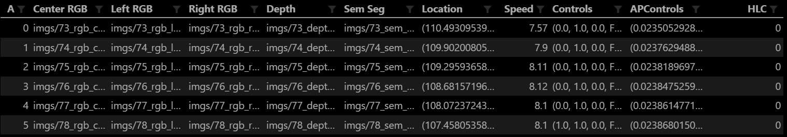

# Carla Controller

The purpose of this repository is two-fold:
1) To generate driving datasets using the CARLA simulator (`data_generator.py`)
2) Use the CARLA simulator to test the performance of deep learning models trained to drive autonomously (`TODO.py`)

## Setup Guide (Windows)

1. Download and install Anaconda.
2. Download and extract [Carla v. 0.8.2](https://github.com/carla-simulator/carla/releases/tag/0.8.2)
3. Navigate to the extracted folder and create a new file named `CarlaSettings.ini`:
    ``` ini
    [CARLA/Server]
    ; Time-out in milliseconds for the networking operations.
    ServerTimeOut=999999999;
    ```
4. Navigate to the directory where you want to store the project.
5. Clone and open the repo:

    ```
    git clone https://github.com/MaxJohnsen/carla-controller && cd carla-controller
    ```

6. Install dependencies in a new Conda environment:

    ```
    conda env create -f environment.yml
    ```

7. Activate the new environment:

    ```
    conda activate carla-controller
    ```
 
 ---

 ## Data Generator
 The data generator is used to control the CARLA simulator (either by manual control or using an autopilot) while saving driving data to the hard drive. The generated datasets can then be used to train deep learning models for autonomous driving.

### Running the Data Generator

1. Navigate to the extracted _Carla v. 0.8.2_ folder.
2. Run the server:
    ```
    CarlaUE4.exe -Carla-server -windowed -carla-settings="CarlaSettings.ini"
    ```
3. A CARLA simulator window should open, displaying a black background. The server is now waiting for a client to connect.
4. In a new cmd window, navigate to the project repository.
5. Run the Carla controller: 
    ```
    python data_generator.py
    ```

    For help run: 
    ```
    python data_generator.py --help
    ```  
6. A Pygame window should open. You are now ready to start generating data. See [Controlling the Simulator](#controlling-the-simulator).

### Arguments 
```
Usage: data_generator.py [-h] [-v] [--host H] [-j] [-p P] [-o PATH]
```
You can run the data generator with different arguments to customize the controller: 

Argument | Description | Default 
--- | --- | ---
-h, --help | Displays help message |
-v, --verbose| Print debug info | 
--host | IP of the host server | localhost
-j, --joystick | Control the vehicle with an external joystick (e.g. a steering wheel) | 
-p, --port | TCP port to listen to | 2000
-o, --output | Output folder for driving data |

Example: `python data_generator.py -v -p 2001 -o data_output` will listen at port 2001, print debug information, and save recorded driving data to a folder called _data_output_


### Controller and simulator configuration

Update the project's configuration file (`settings.idi`) to customize the behavior of the controller and the simulator.

Section | Key | Description | Default Value
--- | --- | --- | ---
Carla | NumberOfVehicles | The number of non-player vehicles in the simulated world. | 50
Carla | NumberOfPedastrians | The number of pedestrians in the simulated world. | 30
Carla | WeatherId | Weather and lighting configuration. Read more [here](https://carla.readthedocs.io/en/latest/carla_settings/). | 0
Carla | RandomizeWeather | Randomly select weather and lighting conditions.  | no
Carla | QualityLevel | The quality level of the simulated world. | Epic
Pygame | WindowHeight | The height of the Pygame window. | 1024
Pygame | WindowWidht | The width of the Pygame window. | 768
Pygame | OutputImageHeight | The height of the output images .| 300
Pygame | OutputImageWidth | The width of the output images. | 180
Controller | AutoStartRecording | Automatically enable recording at the beginning of a new episode (after a small delay). | no
Controller | FrameLimit | Restart episode when the frame limit is reached. | 0
Controller | EpisodeLimit | Exit the program when the episode limit is reached. | 0
AutoPilot | Noise | Noise applied to the auto pilot's steering angle to prevent perfect driving. _Note: The noise are not applied to the logged autopilot data_ | 0

 ### Controlling the simulator  

Key | Action
--- | ---
 A, ← | Steer left 
 D, → | Steer right 
 W, ↑ | Throttle 
 S, ↓ | Break
 Space | Handbreak
 Q | Toggle reverse 
 P | Toggle autopilot
 R | Toggle driving data recording
 E | Start a new episode 

### Data Recording

#### Usage example
1) Start the data generator (the `--output` argument is required for data recording)
```
python data_generator.py -o data_output
```
2) Start recording by pressing the `R`-key.
3) Drive around.
4) Stop recording by pressing `R` again.
5) The simulator freezes while the data are being written to the disk.

_Note:_
- Starting a new episode while recording will end the recording and write the data to disk
- The driving data from any additional recordings within a single episode will be appended to the end of that episode's driving log

#### What data is recorded?

Data | Description |  Driving Log Format | Driving Log Header 
--- | --- | --- | ---
RGB Image, Center | A forward facing RGB image from the center of the car. | Relative path | CenterRGB
RGB Image, Left | A forward facing RGB image from the left side of the car. | Relative path|  LeftRGB
RGB Image, Right| A forward facing RGB image from the left side of the car. | Relative path|  RightRGB
Depth Map | A forward facing depth map, represented by a grayscale image. | Relative path |  Depth
Semantic Segmentation | A perfectly classified forward facing image. Objects are displayed in different colors according to the object class. | Relative Path | SemSeg
Location | The location of the vehicle. | (X-pos, Y-pos, Z-pos) | Location
Speed | The speed of the vehicle. |  | Speed
Player Controls | The vehicle's current control signals. | (Steering angle, throttle, brake, reverse_enabled) | Controls
Autopilot Controls | The CARLA server's proposed control signals. | (Steering angle, throttle, brake, reverse_enabled) | APControls
High-Level Command | The current activated high-level command (see section #todo). | | HLC
Speed-Limit | The current speed-limit. | | SpeedLimit
Traffic Light | The car's current facing traffic-light. | | TrafficLight

#### Directory Structure
- `[output-folder]/`
    - `[episode timestamp]/`
        - `imgs/`
            - `[frame]_rgb_center.png`
            - `[frame]_rgb_left.png`
            - `[frame]_rgb_right.png`
            - `[frame]_rgb_depth.png`
            - `[frame]_rgb_sem_seg.png`
        - `driving_log.csv`

#### Driving Log Structure
_Example image from a `driving_log.csv` file:_


